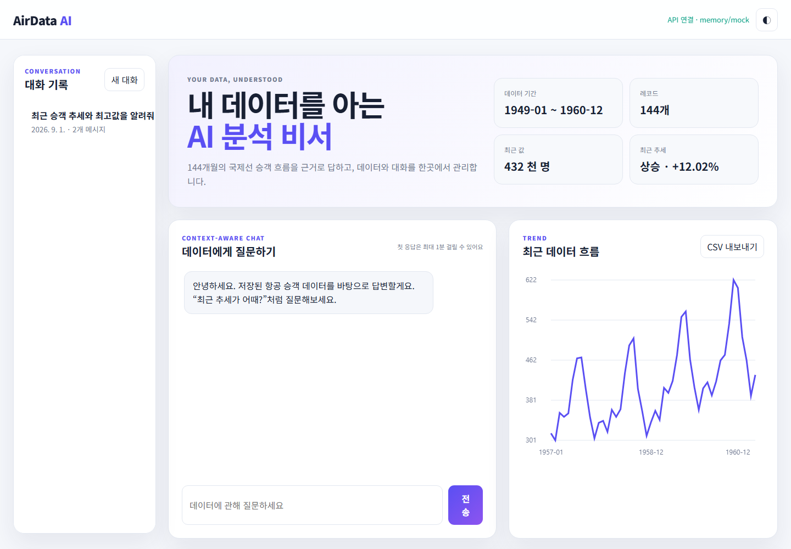
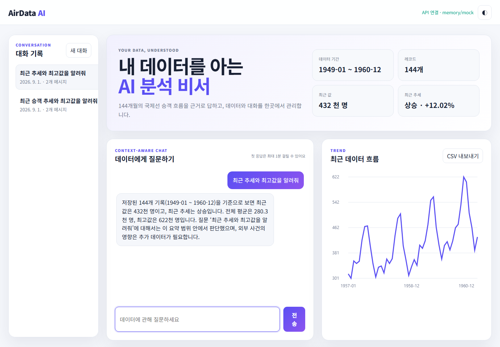
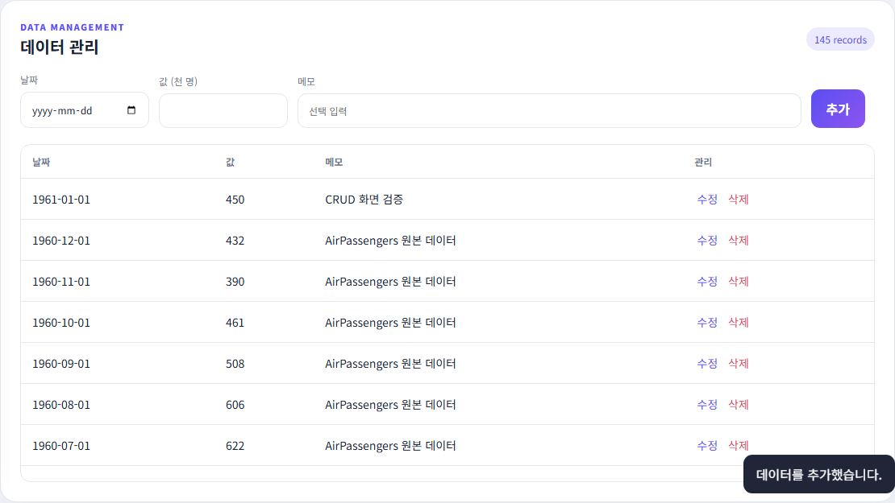

# AirData AI — 내 데이터를 이해하는 AI 분석 비서

AirData AI는 1949~1960년 국제선 승객 시계열 144개를 저장·요약하고, 그 요약을 OpenAI 시스템 지침에 주입해 사용자 데이터에 맞는 답변을 제공하는 풀스택 웹 애플리케이션입니다.

## 주요 기능

- 데이터 기반 AI 채팅 및 응답 로딩 표시
- 날짜·값·메모 데이터 추가, 조회, 수정, 삭제
- 기간·개수·합계·평균·최대·최소·최근 추세 요약
- 대화 자동 저장, 목록 조회, 특정 대화 불러오기, 삭제 API
- Firestore 운영 저장소와 메모리 기반 로컬 개발 저장소
- Swagger UI, CORS, Pydantic 요청 검증, 환경 변수 기반 비밀 관리
- 보너스: Canvas 추세 그래프, CSV 내보내기, 다크 모드

## 기술 스택

- 백엔드: Python 3.10+, FastAPI, Uvicorn, Pydantic
- 데이터베이스: Firebase Firestore
- AI: OpenAI Python SDK 및 Responses API
- 프론트엔드: HTML, CSS, JavaScript(Canvas 포함)
- 배포: Render(백엔드), Vercel(프론트엔드)
- 테스트: pytest, FastAPI TestClient, Playwright 화면 검증

## 아키텍처

```text
사용자 브라우저 (Vercel)
        │ REST/JSON
        ▼
FastAPI 백엔드 (Render)
  ├─ /api/data ───────────────┐
  ├─ /api/data/summary        ├─ Firestore
  ├─ /api/conversations ──────┘  ├─ data
  └─ /api/chat                   └─ conversations
        │
        ├─ 데이터 요약 생성
        ├─ 시스템 instructions에 요약 주입
        └─ OpenAI Responses API 호출
```

OpenAI API에는 데이터 전체가 아니라 서버가 계산한 기간, 개수, 주요 통계, 최근 추세를 지침으로 전달합니다. 공식 Responses API의 `instructions`에 시스템 지침을 넣고, `input`에 최근 대화와 질문을 전달합니다. 응답은 `output_text`로 읽으며, 비용 제한을 위해 `max_output_tokens`를 설정했습니다. 자세한 API 방식은 [OpenAI Responses API 공식 문서](https://developers.openai.com/api/reference/cli/resources/responses/methods/create)를 참고했습니다.

## 프로젝트 구조

```text
M1-2/
├─ backend/
│  ├─ app/
│  │  ├─ routers/          # data, conversations, chat API
│  │  ├─ repositories/     # Firestore / memory 저장소
│  │  ├─ services/         # 요약과 AI 응답 로직
│  │  ├─ config.py         # 환경 변수 설정
│  │  ├─ models.py         # Pydantic 요청·응답 모델
│  │  └─ main.py           # FastAPI 앱과 CORS
│  ├─ data/air_passengers.csv
│  ├─ tests/
│  ├─ seed_firestore.py
│  ├─ requirements.txt
│  └─ render.yaml
├─ frontend/
│  ├─ index.html
│  ├─ styles.css
│  ├─ app.js
│  └─ config.js
├─ screenshots/
├─ scripts/build.mjs
├─ package.json
└─ vercel.json
```

## API 목록

| 메서드 | 경로 | 기능 |
|---|---|---|
| POST | `/api/data` | 데이터 추가 |
| GET | `/api/data` | 데이터 목록 |
| PUT | `/api/data/{id}` | 데이터 수정 |
| DELETE | `/api/data/{id}` | 데이터 삭제 |
| GET | `/api/data/summary` | 프롬프트용 요약 |
| GET | `/api/data/export.csv` | CSV 내보내기 |
| POST | `/api/conversations` | 대화 저장 |
| GET | `/api/conversations` | 대화 목록(messages 포함) |
| GET | `/api/conversations/{id}` | 특정 대화 전체 조회 |
| DELETE | `/api/conversations/{id}` | 대화 삭제 |
| POST | `/api/chat` | 요약 주입 AI 채팅 및 대화 자동 저장 |
| GET | `/api/health` | 배포 상태 확인 |

## 로컬 실행

### 1. 백엔드

```powershell
cd backend
python -m venv .venv
.venv\Scripts\Activate.ps1
python -m pip install -r requirements.txt
Copy-Item .env.example .env
python -m uvicorn app.main:app --reload
```

기본 `.env.example`은 `STORAGE_BACKEND=memory`, `AI_BACKEND=mock`이므로 Firebase·OpenAI 키 없이도 144개 샘플 데이터와 전체 UX를 테스트할 수 있습니다. Swagger UI는 <http://127.0.0.1:8000/docs>에서 확인합니다.

### 2. 프론트엔드

새 터미널에서 다음 명령을 실행합니다.

```powershell
cd frontend
python -m http.server 3000
```

브라우저에서 <http://127.0.0.1:3000>을 엽니다.

### 3. 테스트

```powershell
cd backend
python -m pytest -v
```

## 환경 변수

| 변수 | 필수 환경 | 설명 |
|---|---|---|
| `STORAGE_BACKEND` | 운영 | `firestore` 또는 `memory` |
| `AI_BACKEND` | 운영 | `openai` 또는 `mock` |
| `OPENAI_API_KEY` | OpenAI 모드 | 서버 전용 OpenAI API 키 |
| `OPENAI_MODEL` | 선택 | 기본 `gpt-5-mini` |
| `OPENAI_MAX_OUTPUT_TOKENS` | 선택 | 기본 500, 비용 제한 |
| `FIREBASE_SERVICE_ACCOUNT_JSON` | Firestore 모드 | 서비스 계정 JSON 전체 문자열 |
| `FIREBASE_SERVICE_ACCOUNT_PATH` | 로컬 선택 | 서비스 계정 JSON 파일 경로 |
| `ALLOWED_ORIGINS` | 운영 | 쉼표로 구분한 Vercel/로컬 허용 주소 |
| `API_BASE_URL` | Vercel 빌드 | 배포된 Render API 주소 |

서비스 계정 JSON과 API 키는 저장소에 커밋하지 않습니다. `.gitignore`에 `.env`와 서비스 계정 파일 패턴을 포함했습니다.

## Firebase 설정 및 초기 데이터 적재

1. Firebase Console에서 프로젝트와 Firestore Database를 생성합니다.
2. 프로젝트 설정 → 서비스 계정에서 새 비공개 키를 생성합니다.
3. Render에는 JSON 전체를 `FIREBASE_SERVICE_ACCOUNT_JSON` 비밀 환경 변수로 등록합니다.
4. 로컬에서는 JSON 파일 경로를 `FIREBASE_SERVICE_ACCOUNT_PATH`로 지정할 수 있습니다.
5. 빈 Firestore에 144개 샘플을 한 번만 적재합니다.

```powershell
cd backend
$env:STORAGE_BACKEND='firestore'
$env:FIREBASE_SERVICE_ACCOUNT_PATH='C:\secure\service-account.json'
python seed_firestore.py
```

기존 `data` 문서가 하나라도 있으면 중복 적재를 자동 중단합니다.

### Firestore 컬렉션

- `data/{id}`: `date`, `value`, `memo`, `created_at`, `updated_at`
- `conversations/{id}`: `title`, `messages[]`, `created_at`, `updated_at`

## 배포

### Render 백엔드

1. GitHub 저장소를 연결하고 Blueprint 또는 Web Service를 생성합니다.
2. 루트의 `backend/render.yaml`을 기준으로 설정합니다.
3. `OPENAI_API_KEY`, `FIREBASE_SERVICE_ACCOUNT_JSON`, `ALLOWED_ORIGINS`를 Render 비밀 환경 변수로 등록합니다.
4. 배포 후 `/api/health`와 `/docs`를 확인합니다.
5. 무료 인스턴스는 슬립 후 첫 요청이 늦을 수 있어 프론트에 안내 문구와 로딩 표시를 넣었습니다.

### Vercel 프론트엔드

1. 같은 저장소를 Vercel에 연결합니다.
2. 빌드 명령은 `npm run build`, 출력 폴더는 `dist`입니다.
3. `API_BASE_URL`을 Render 백엔드 URL로 설정합니다.
4. 발급된 Vercel URL을 Render의 `ALLOWED_ORIGINS`에 추가하고 다시 배포합니다.

## 배포 URL

- 프론트엔드: 배포 후 기록
- 백엔드 API: 배포 후 기록
- Swagger UI: 배포 후 기록

## 제출 스크린샷

### 데이터 요약과 추세 그래프



### 데이터 기반 채팅과 대화 기록



### 데이터 CRUD 화면



### Swagger UI


## 검증 결과

- FastAPI 자동 테스트 5개 통과
- 144개 초기 데이터 및 요약 수치 확인
- 데이터 CRUD, CSV 내보내기 확인
- 컨텍스트 반영 mock 채팅, 대화 자동 저장·불러오기 확인
- Swagger UI 접근 확인
- 프론트 빌드 및 JavaScript 문법 검사 통과

## 비용 및 운영 주의

- OpenAI 모드에서는 개인 API 키 과금이 발생할 수 있습니다.
- 기본 출력 한도는 500토큰이며 최근 대화 10개만 모델에 전달합니다.
- 브라우저에는 OpenAI/Firebase 키를 전달하지 않습니다.
- 프로덕션에서는 반드시 `STORAGE_BACKEND=firestore`, `AI_BACKEND=openai`로 설정합니다.
